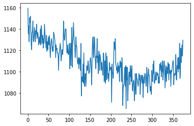

---
redirect_from:
  - "/acces-load-data/fmri-basics"
interact_link: content/acces_load_data/fmri_basics.ipynb
kernel_name: python3
has_widgets: false
title: 'section a'
prev_page:
  url: /acces_load_data/acces_load_data.html
  title: 'Access and load data'
next_page:
  url: /acces_load_data/parrec_tests.html
  title: 'section b'
comment: "***PROGRAMMATICALLY GENERATED, DO NOT EDIT. SEE ORIGINAL FILES IN /content***"
---
# Basics of fMRI data handling and plotting

This example shows the basics of how to download, load, manipulate and plot typical functional MRI data using Python libraries.


## Imports


<div markdown="1" class="cell code_cell">
<div class="input_area" markdown="1">
```python
import os
import numpy as np
import nibabel as nib
import matplotlib.pyplot as plt
from niwidgets import NiftiWidget

```
</div>

</div>


## Locate data


<div markdown="1" class="cell code_cell">
<div class="input_area" markdown="1">
```python
sub_dir = '/Users/jheunis/Desktop/sub-01'
func_niiz = os.path.join(sub_dir, 'func', 'sub-01_task-passiveimageviewing_bold.nii.gz') 
struct_niiz = os.path.join(sub_dir, 'anat', 'sub-01_T1w.nii.gz') 

```
</div>

</div>


## Load structural image data and display header information


<div markdown="1" class="cell code_cell">
<div class="input_area" markdown="1">
```python
struct_img = nib.load(struct_niiz)
# print(struct_img.affine.shape)
struct_data = struct_img.get_fdata()
print('Structural image dimensions: {}'.format(struct_img.shape))
struct_hdr = struct_img.header
print('Structural image header:\n{}'.format(struct_hdr))

```
</div>

<div class="output_wrapper" markdown="1">
<div class="output_subarea" markdown="1">
{:.output_stream}
```
Structural image dimensions: (175, 288, 288)
Structural image header:
<class 'nibabel.nifti1.Nifti1Header'> object, endian='<'
sizeof_hdr      : 348
data_type       : b''
db_name         : b''
extents         : 0
session_error   : 0
regular         : b'r'
dim_info        : 0
dim             : [  3 175 288 288   1   1   1   1]
intent_p1       : 0.0
intent_p2       : 0.0
intent_p3       : 0.0
intent_code     : none
datatype        : float32
bitpix          : 32
slice_start     : 0
pixdim          : [-1.  1.  1.  1.  1.  0.  0.  0.]
vox_offset      : 0.0
scl_slope       : nan
scl_inter       : nan
slice_end       : 0
slice_code      : unknown
xyzt_units      : 10
cal_max         : 0.0
cal_min         : 0.0
slice_duration  : 0.0
toffset         : 0.0
glmax           : 0
glmin           : 0
descrip         : b'FSL5.0'
aux_file        : b'                       '
qform_code      : scanner
sform_code      : aligned
quatern_b       : 0.0
quatern_c       : 1.0
quatern_d       : 0.0
qoffset_x       : 82.479
qoffset_y       : -133.393
qoffset_z       : -89.849
srow_x          : [-9.9848199e-01  5.5064064e-02 -1.0572543e-03  8.1903908e+01]
srow_y          : [ 5.3585816e-02  9.7575200e-01  2.1221888e-01 -1.5181621e+02]
srow_z          : [-1.2717275e-02 -2.1184018e-01  9.7722149e-01 -5.6531796e+01]
intent_name     : b''
magic           : b'n+1'
```
</div>
</div>
</div>


## Plot T1-weighted structural image


<div markdown="1" class="cell code_cell">
<div class="input_area" markdown="1">
```python
my_widget = NiftiWidget(struct_niiz)
my_widget.nifti_plotter()

```
</div>

<div class="output_wrapper" markdown="1">
<div class="output_subarea" markdown="1">

{:.output_png}


</div>
</div>
</div>


## Load functional time series data and display header information


<div markdown="1" class="cell code_cell">
<div class="input_area" markdown="1">
```python
func_img = nib.load(func_niiz)
data = func_img.get_fdata()
hdr = func_img.header
print('Functional image dimensions: {}'.format(func_img.shape))
hdr = func_img.header
print('Functional image header:\n{}'.format(hdr))

```
</div>

<div class="output_wrapper" markdown="1">
<div class="output_subarea" markdown="1">
{:.output_stream}
```
Functional image dimensions: (64, 64, 30, 375)
Functional image header:
<class 'nibabel.nifti1.Nifti1Header'> object, endian='<'
sizeof_hdr      : 348
data_type       : b''
db_name         : b''
extents         : 0
session_error   : 0
regular         : b'r'
dim_info        : 0
dim             : [  4  64  64  30 375   1   1   1]
intent_p1       : 0.0
intent_p2       : 0.0
intent_p3       : 0.0
intent_code     : none
datatype        : float32
bitpix          : 32
slice_start     : 0
pixdim          : [-1.       4.       4.       3.98667  1.6      0.       0.       0.     ]
vox_offset      : 0.0
scl_slope       : nan
scl_inter       : nan
slice_end       : 0
slice_code      : unknown
xyzt_units      : 10
cal_max         : 0.0
cal_min         : 0.0
slice_duration  : 0.0
toffset         : 0.0
glmax           : 0
glmin           : 0
descrip         : b'FSL5.0'
aux_file        : b'                       '
qform_code      : scanner
sform_code      : aligned
quatern_b       : 0.0
quatern_c       : 1.0
quatern_d       : 0.0
qoffset_x       : 121.479
qoffset_y       : -124.0
qoffset_z       : -42.0837
srow_x          : [-4.00000e+00 -9.28510e-21  6.77626e-21  1.21479e+02]
srow_y          : [ 7.27364e-16  4.00000e+00 -2.71051e-20 -1.24000e+02]
srow_z          : [ 1.24155e-16  4.84096e-17  3.98667e+00 -4.20837e+01]
intent_name     : b''
magic           : b'n+1'
```
</div>
</div>
</div>


## Plot single voxel timeseries


<div markdown="1" class="cell code_cell">
<div class="input_area" markdown="1">
```python
%matplotlib inline

plt.plot(data[32, 32, 15, :]);

```
</div>

<div class="output_wrapper" markdown="1">
<div class="output_subarea" markdown="1">

{:.output_png}


</div>
</div>
</div>

